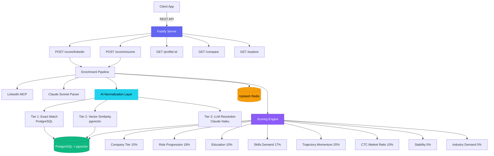
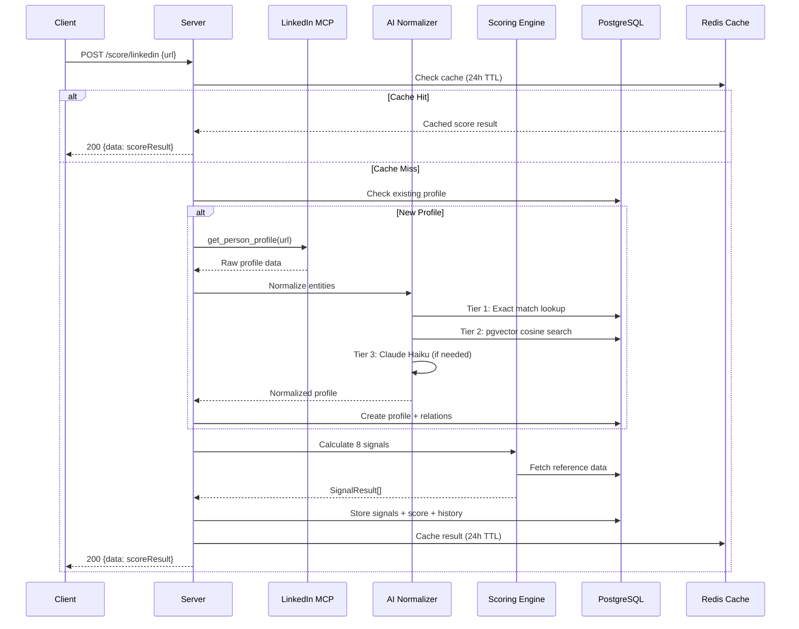
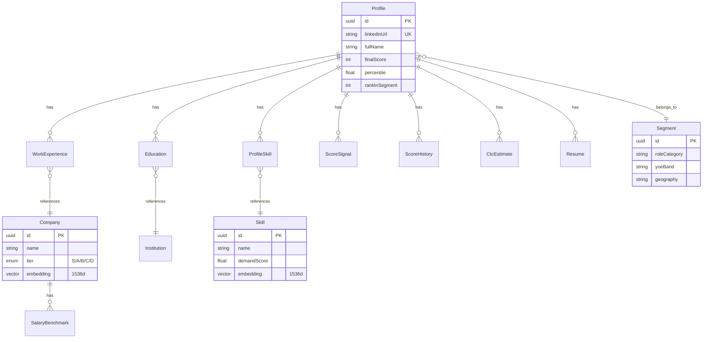
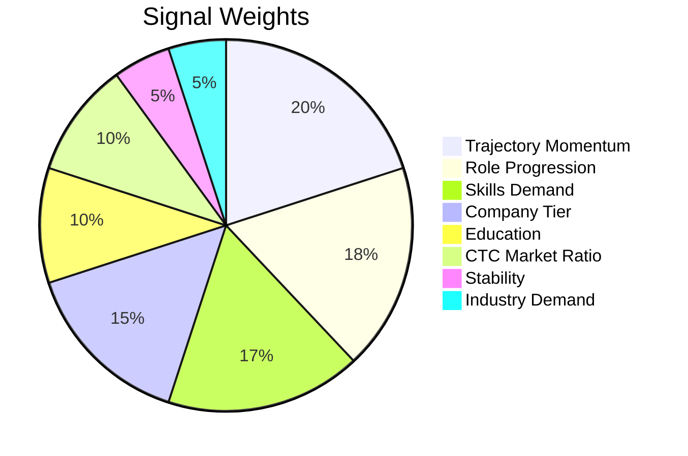

# Scodash Server

> **PageRank for careers** — a zero-friction talent scoring engine that ranks professionals with a composite score (0–10,000) derived from 8 career signals.

## Architecture



## Scoring Pipeline



## Data Model



## 8 Scoring Signals



## Quick Start

```bash
# 1. Install dependencies
npm install

# 2. Set up environment
cp .env.example .env
# Fill in: DATABASE_URL, UPSTASH_REDIS_*, ANTHROPIC_API_KEY, OPENAI_API_KEY

# 3. Push schema to database
npm run db:push

# 4. Seed reference data
npm run seed:all

# 5. Start dev server
npm run dev
# → Server running at http://localhost:3001
```

## API Endpoints

| Method | Path | Description |
|--------|------|-------------|
| `POST` | `/score/linkedin` | Score a LinkedIn profile by URL |
| `POST` | `/score/resume` | Score from resume upload (PDF/DOCX) |
| `GET` | `/profile/:id` | Get full scored profile with signal breakdown |
| `GET` | `/compare?ids=a,b` | Compare two profiles side-by-side |
| `GET` | `/explore` | Browse ranked profiles with filters |
| `GET` | `/health` | Health check |

## Tech Stack

- **Fastify 5** — high-performance Node.js server
- **TypeScript** — strict mode, ESM
- **Prisma + pgvector** — PostgreSQL ORM with vector similarity search
- **Upstash Redis** — caching and rate limiting
- **Claude API** — Haiku (entity matching), Sonnet (resume parsing)
- **OpenAI** — text-embedding-3-small (1536d vectors)
- **Zod** — runtime validation for all inputs
