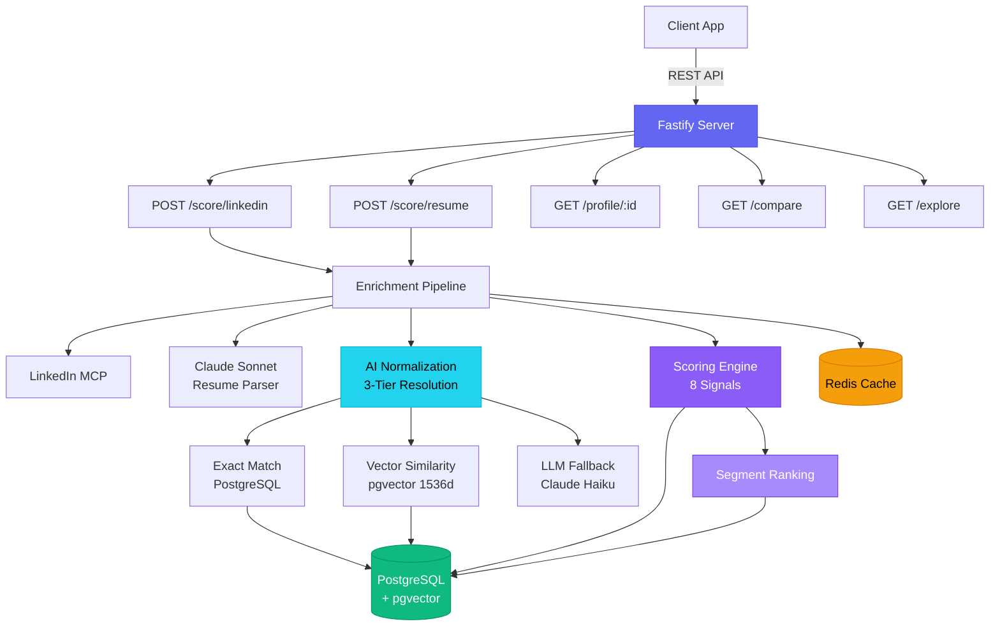
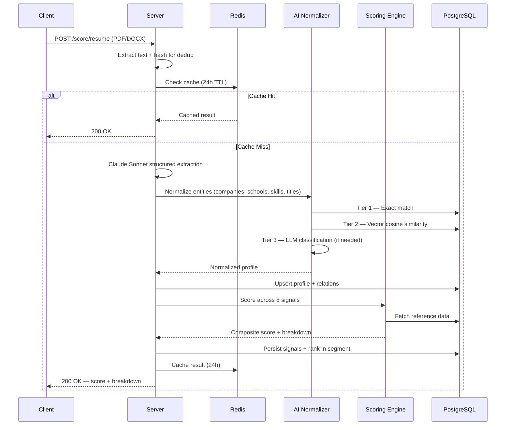
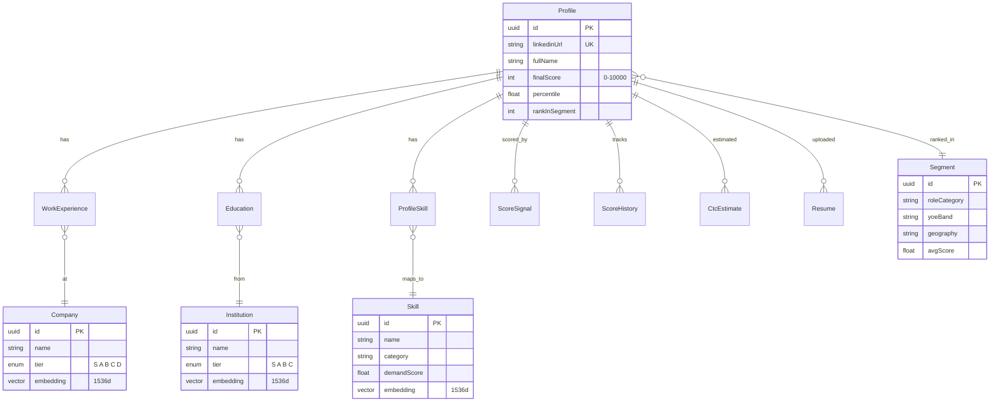

<p align="center">
  <h1 align="center">Scodash Server</h1>
  <p align="center">
    <strong>AI-powered talent scoring engine API</strong>
    <br />
    Quantifies professional profiles into a composite score (0–10,000) using multi-signal analysis, AI entity normalization, and segment-based ranking.
    <br /><br />
    <a href="#api-endpoints">API Docs</a> · <a href="#quick-start">Quick Start</a> · <a href="#architecture">Architecture</a>
  </p>
</p>

---

## Overview

Scodash Server is a standalone REST API that ingests professional profiles — via resume upload (PDF/DOCX) or LinkedIn URL — and produces a normalized, comparable score. It solves the problem of objectively evaluating talent across different companies, roles, education backgrounds, and career trajectories.

### What it does

- **Resume Scoring** — Upload a PDF or DOCX resume. Claude Sonnet extracts structured data, entities are normalized against a curated reference database, and a composite score is calculated.
- **LinkedIn Scoring** — Submit a LinkedIn profile URL. The server fetches profile data via MCP, normalizes it, and scores it through the same pipeline.
- **Profile Comparison** — Compare any two scored profiles side-by-side with per-signal deltas.
- **Explore & Rank** — Browse all scored profiles with filters (role, experience, location, minimum score) and full-text search, ranked by segment.
- **AI Entity Normalization** — Companies, institutions, skills, and job titles are resolved to canonical entries using a 3-tier system ensuring consistency across different resume formats and naming conventions.

### How scoring works

Every profile is evaluated across **8 independent signals** that capture different dimensions of professional strength — from employer quality to career trajectory to market positioning. Each signal produces a normalized score, and the weighted composite maps to a **0–10,000 scale**. Profiles are then ranked within their **segment** (role category × experience band × geography) for meaningful peer comparison.

> The specific signal weights, formulas, and thresholds are proprietary.

---

## Architecture



### Ingestion Pipeline



### Data Model



---

## Tech Stack

| Layer | Technology | Purpose |
|-------|-----------|---------|
| **Runtime** | Node.js 20+, TypeScript (strict, ESM) | Type-safe server with modern module system |
| **Framework** | Fastify 5 | High-performance HTTP server (~2-3x Express throughput) |
| **Database** | PostgreSQL (Neon) + pgvector | Relational storage with vector similarity search |
| **ORM** | Prisma | Type-safe database access with migrations |
| **Cache** | Upstash Redis | Score caching (24h TTL) and rate limiting |
| **AI — Parsing** | Claude Sonnet (Anthropic) | Structured resume extraction from PDF/DOCX |
| **AI — Matching** | Claude Haiku (Anthropic) | Entity resolution fallback for ambiguous matches |
| **AI — Embeddings** | text-embedding-3-small (OpenAI) | 1536d vectors for semantic similarity search |
| **Validation** | Zod | Runtime schema validation for all inputs and env vars |

---

## API Endpoints

### Score a Resume

```
POST /score/resume
Content-Type: multipart/form-data
```

Upload a PDF or DOCX resume (max 10MB). Returns the full score breakdown.

### Score a LinkedIn Profile

```
POST /score/linkedin
Content-Type: application/json

{ "url": "https://linkedin.com/in/username" }
```

Fetches and scores a LinkedIn profile via MCP integration.

### Get Profile

```
GET /profile/:id
```

Returns the full scored profile including work history, education, skills, signal breakdown, score history, and segment ranking.

### Compare Profiles

```
GET /compare?ids=uuid1,uuid2
```

Side-by-side comparison of two profiles with per-signal deltas showing where each candidate is stronger.

### Explore Profiles

```
GET /explore?role=backend&yoe=3-5&location=india&minScore=5000&q=react&sort=score&page=1&limit=20
```

Browse and filter ranked profiles. Supports full-text search, role/experience/location filters, minimum score threshold, and pagination.

### Health Check

```
GET /health
```

Returns server status, database connectivity, and uptime.

---

## Entity Normalization

A key challenge in talent evaluation is that the same entity appears differently across resumes — "Google", "Google LLC", "Alphabet Inc.", "Google India Pvt Ltd" should all resolve to the same canonical company. Scodash uses a **3-tier resolution system**:

| Tier | Method | Latency | Cost |
|------|--------|---------|------|
| **1** | Exact match on normalized name + aliases | ~0ms | Free |
| **2** | pgvector cosine similarity search (1536d embeddings) | ~5ms | Near-free |
| **3** | Claude Haiku LLM classification from top candidates | ~200ms | ~$0.001/call |

This applies to **companies**, **institutions**, **skills**, and **job titles**. When Tier 3 resolves a match, the alias is automatically added to Tier 1 for future lookups — the system gets faster over time.

---

## Reference Data

The server ships with curated seed data:

| Entity | Count | Details |
|--------|-------|---------|
| **Companies** | 44 | Tiered S through D (FAANG → service companies) |
| **Institutions** | 32 | Tiered S through C (IITs, IIMs, global universities) |
| **Skills** | 58 | Languages, frameworks, AI/ML, cloud, databases, system design |
| **Salary Benchmarks** | 39 | Role × YOE × location → min/median/max CTC |
| **Industries** | 20 | With demand scores and growth rates |

All entities include pre-computed 1536-dimension embeddings for Tier 2 vector matching.

---

## Quick Start

### Prerequisites

- Node.js 20+
- PostgreSQL database with pgvector extension (e.g., [Neon](https://neon.tech))
- Upstash Redis account
- Anthropic API key
- OpenAI API key

### Setup

```bash
# Clone the repository
git clone https://github.com/Sarthak88-cypher/Server_Scodash.git
cd Server_Scodash

# Install dependencies
npm install

# Configure environment
cp .env.local .env
# Edit .env with your credentials:
#   DATABASE_URL, UPSTASH_REDIS_REST_URL, UPSTASH_REDIS_REST_TOKEN,
#   ANTHROPIC_API_KEY, OPENAI_API_KEY

# Push database schema
npm run db:push

# Seed reference data + generate embeddings
npm run seed:all

# Start the server
npm run dev
```

The server starts at **http://localhost:8001**.

### Available Scripts

| Script | Description |
|--------|-------------|
| `npm run dev` | Start dev server with hot reload |
| `npm run build` | Compile TypeScript to `dist/` |
| `npm start` | Run compiled production build |
| `npm run db:push` | Push Prisma schema to database |
| `npm run db:migrate` | Create and apply a migration |
| `npm run db:seed` | Seed base data (industries) |
| `npm run seed:all` | Run all seed scripts + generate embeddings |
| `npm run typecheck` | Run TypeScript type checker |

---

## Project Structure

```
src/
├── index.ts                  # Entry point
├── app.ts                    # Fastify app factory + plugin registration
├── config/
│   └── env.ts                # Zod-validated environment config
├── plugins/
│   ├── prisma.ts             # Database client lifecycle
│   └── redis.ts              # Cache client setup
├── routes/
│   ├── score/                # Ingestion endpoints (linkedin, resume)
│   ├── profile/              # Profile retrieval
│   ├── compare/              # Side-by-side comparison
│   └── explore/              # Filtered browsing + search
├── services/
│   ├── ai/                   # Entity normalization + resume parsing
│   ├── scoring/              # Signal computation + ranking
│   └── enrichment/           # Ingestion pipeline orchestration
├── lib/                      # Shared errors + utilities
└── types/                    # TypeScript interfaces + Zod schemas
```

---

## License

Proprietary. All rights reserved.
